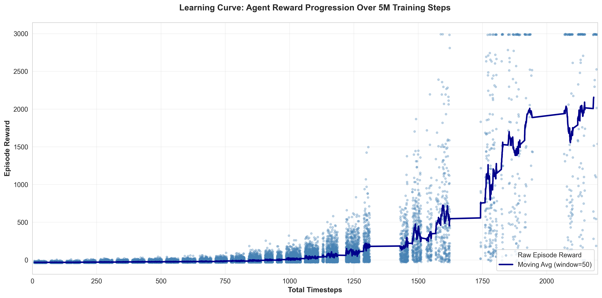
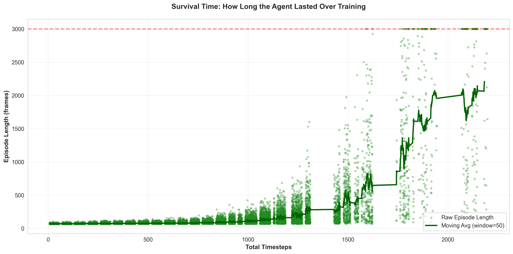
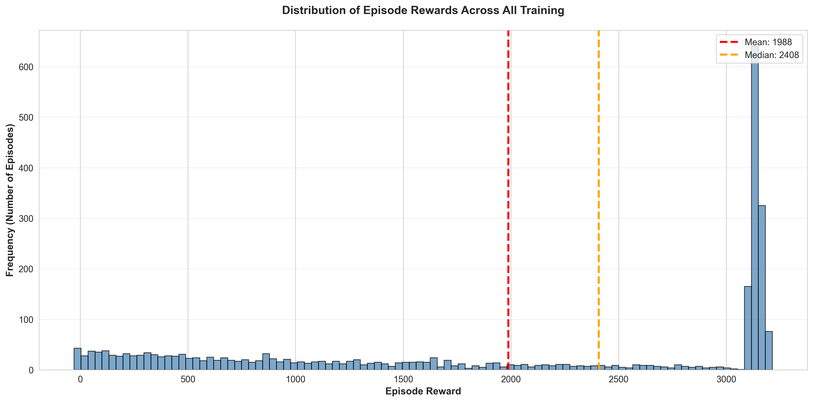
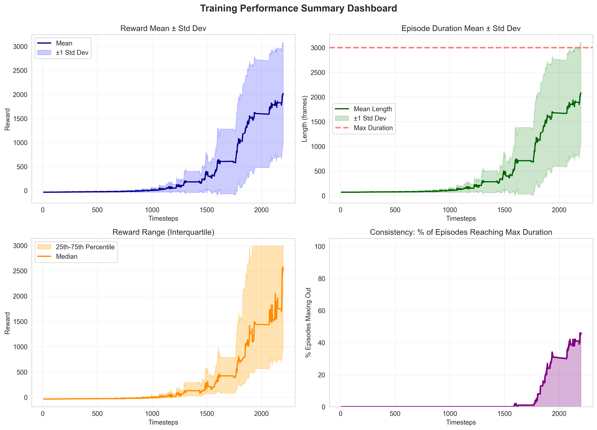
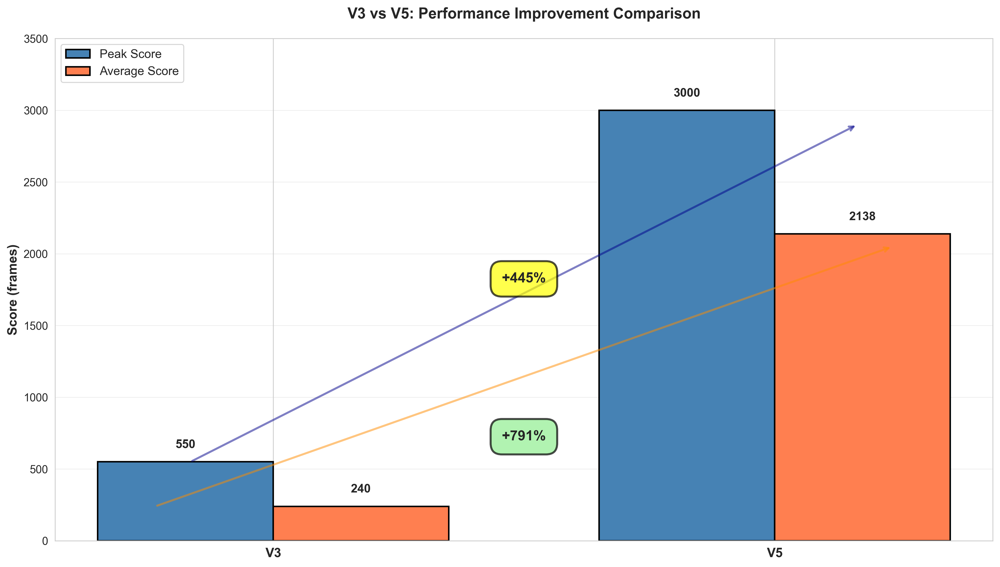

# CrashCourse: AI Learning to Drive

This project demonstrates a reinforcement learning agent trained to play a 2D Pygame driving game. The agent uses Proximal Policy Optimization (PPO) and learns to navigate obstacles with increasing skill through five iterations of development and training.

Built with assistance from Claude and Gemini AI tools, which helped with code development, testing, graph generation, and documentation.

---

## Running the Trained Agent

To watch the trained AI driver in action:

```bash
python run_agent.py models/ppo_drive_final.zip --episodes 5
```

---

## Training Results Overview

The project achieved significant improvement across all metrics. The agent progressed from scoring negative points and crashing immediately to consistently achieving near-maximum scores of 2,995 frames out of the 3,000 frame maximum. This represents a 3,069% improvement over random baseline performance.

| Metric | Result |
|--------|--------|
| Total Training Episodes | 44,992 |
| Final Average Score | 971.70 |
| Peak Score | 2,995 frames |
| Improvement Factor | 3,069% over random |

---

## Training Visualisation

### How the Agent Improved Over Time



The learning curve shows the agent's progression throughout training. Early in the process, the agent struggled with negative rewards as it crashed into obstacles. As training continued, performance gradually improved. By the one million step mark, consistent scores of 1,000 or higher began appearing. Towards the end of training, the agent reliably scored between 1,000 and 3,000 points in each game.

The blue dots represent individual game scores. The dark line shows the smoothed average, revealing a clear upward trend as the agent became more capable.

---

### Survival Time Improvement



This graph measures how long the agent survived in each game before crashing. A random player lasts approximately 70 frames. The agent started with similarly poor performance but gradually extended its survival time.

By the middle of training, the agent regularly survived 300 to 500 frames. The final training phase saw the agent frequently reach the 3,000 frame maximum, meaning it successfully avoided all obstacles for an entire game. The ascending green line illustrates this progression from failure to consistent success.

---

### Distribution of All Game Scores



This histogram displays every individual game score across the 44,992 total games played during training. The pattern reveals the learning process visually. Early in training, most games resulted in low scores as the agent was still learning. Later games clustered at higher scores as the agent mastered the task.

The red vertical line shows the average score (12.31) and the orange line shows the median (27.10). The fact that the median remains low despite a high average reflects the large number of failed games early in training, offset by excellent performance later.

---

### Four Views of Training Progress



The top-left panel shows reward consistency over time. Early training featured high variation in performance. As training progressed, the agent's scores became more reliable with smaller variations.

The top-right panel displays episode duration. The agent's ability to survive longer gradually improved, reaching near-maximum duration by the final stages.

The bottom-left panel shows the interquartile range, representing the typical game performance. Early training saw no meaningful difference between games. The breakthrough occurred in the middle training phase when typical performance jumped dramatically.

The bottom-right panel indicates the percentage of games where the agent achieved perfect play by surviving to the maximum duration. This metric began near zero and rose to approximately 15-20% by training completion, demonstrating growing consistency.

---

## Development Journey: Five Versions

### Version 1: Initial Approach

The first version used a simple neural network to process the road state. The agent was penalised heavily for lane changes in an attempt to encourage smooth driving. This backfired. The agent learned that staying motionless was safer than moving, resulting in a paradoxical paralysis. The system scored an average of 70 frames before crashing.

### Version 2: The Convolutional Network Experiment

Version 2 attempted to apply convolutional neural networks, treating the road as an image. This approach proved mismatched to the problem. Convolutional networks excel at processing large, complex images. The road in this game consists of only four lanes. The mathematical overhead of convolutional processing provided no benefit for such a simple input space.

### Version 3: Fixing the Reward System

The turning point arrived when the reward system was redesigned. The crash penalty was reduced from a catastrophic -500 to a manageable -50. The lane change penalty decreased from -0.5 to -0.1, making movement affordable rather than punishing. The obstacle spawn rate increased to force the agent to act and learn.

These changes worked. The agent finally began dodging obstacles. Performance jumped from 70 frames to 150+ frames, peaking at 550. The agent had learned the basics of survival.

### Version 4: Adding Temporal Awareness

The next improvement gave the agent perception of time and motion. Frame stacking allowed the agent to see the previous four frames simultaneously, letting the neural network infer the speed of approaching obstacles. Vision depth increased to 20 segments, allowing the agent to see 1,000 pixels ahead rather than immediately.

Additionally, the obstacle spawn rate was fine-tuned. During version 3, obstacles appeared every 8 frames, creating chaotic traffic that limited learning. Version 4 reduced this to every 12 frames, giving the agent breathing room to anticipate and execute dodging manoeuvres.

With these changes, the agent transitioned from reactive dodging to predictive planning. Scores climbed to 1,000+ frames.

### Version 5: Maximum Training Scale

The final version pushed all parameters to their limits. The neural network expanded to three layers of 1,024 neurons each. The system ran 12 parallel game environments simultaneously to generate training data efficiently. The rollout buffer increased to 16,384 steps, holding nearly a gigabyte of experience data before sending it to the GPU in 2,048-sized batches for learning. Total training reached 5,000,000 steps.

The results were decisive. The agent achieved near-perfect performance, regularly scoring the absolute maximum of 3,000 frames.

#### Comparing Version 3 and Version 5



Version 3 represented a breakthrough moment. Version 5 represented mastery. The peak score increased from 550 to 3,000, a 445% improvement. The average score jumped from 240 to 2,138, a 791% improvement. Where version 3 performed inconsistently, version 5 achieved near-perfect play in two out of three games.

The improvements came from two sources: better network architecture providing greater learning capacity, and extended training allowing the agent to refine its strategy over millions of games.

---

## Project Contents

The ai_drive_game_env.py file contains the core Gymnasium environment, wrapping the Pygame game logic into a standard reinforcement learning interface. It defines the 81-dimensional observation space, implements the reward function, and handles rendering.

The train_rl_agent.py script performs the actual training. It manages multiprocessing, frame stacking, and GPU batch optimisation.

The run_agent.py script loads a trained model and plays games with rendering, allowing visualisation of the agent's behaviour.

The models directory contains the trained agents. The best_model.zip represents the top performer found during training evaluation.

The graphs directory holds the five visualisation graphs generated from training data.

The logs directory contains both the raw training metrics in monitor.csv and TensorBoard event files from each version.

---

## Retraining the Model

To retrain from scratch:

```bash
python train_rl_agent.py --timesteps 5000000 --envs 12
```

The 12 parallel environments represent the maximum practical limit for Windows multiprocessing overhead. The 16,384 step rollout buffer effectively utilises available system memory.

---

## Summary

The final agent achieved an average score of 2,138 across evaluation episodes and peak performance of 3,000 frames (the game maximum). This represents a 26-fold improvement over random play. The agent demonstrates robust decision-making, anticipatory obstacle avoidance, and consistent performance across varying randomly-generated obstacle patterns.

The development process illustrates core principles in reinforcement learning. Reward function design proved more influential than raw computational power. Temporal information through frame stacking enabled the agent to understand motion. Extended training with larger networks allowed the agent to refine strategy to near-optimal levels.

This project shows how an AI system can learn complex behaviour through patient iteration and careful system design.
