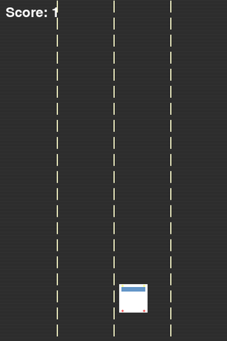
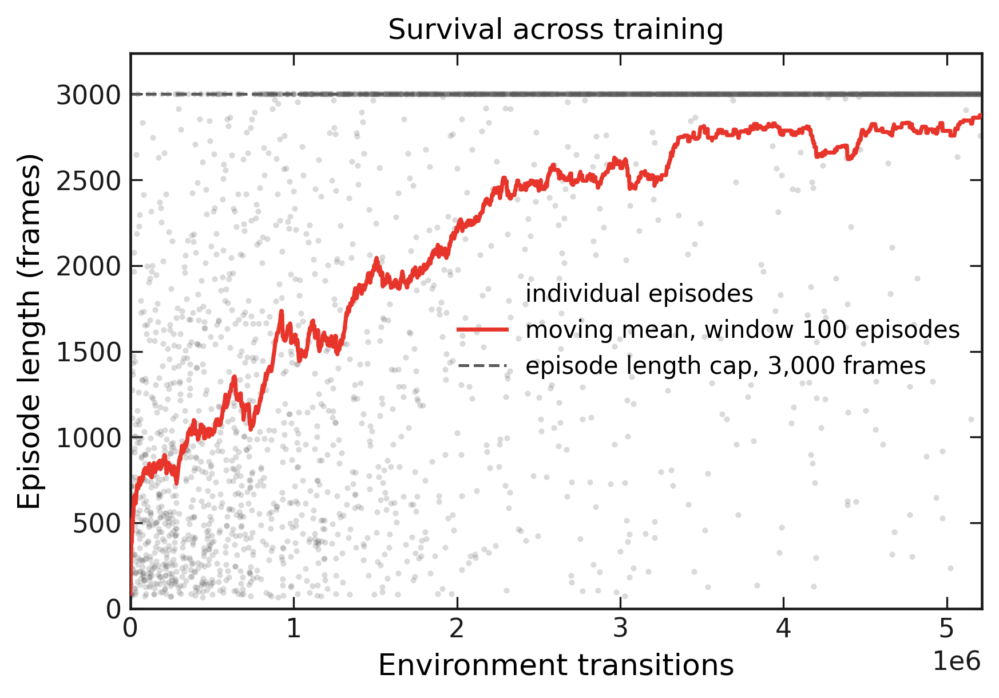
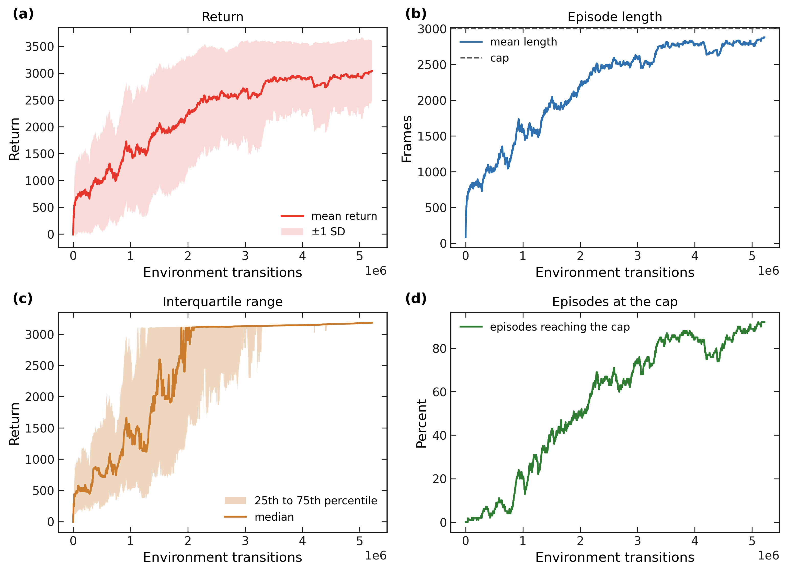
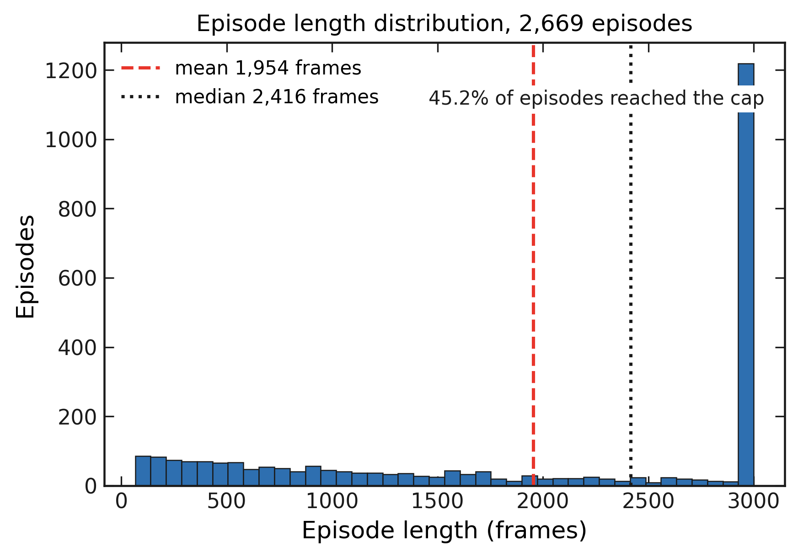
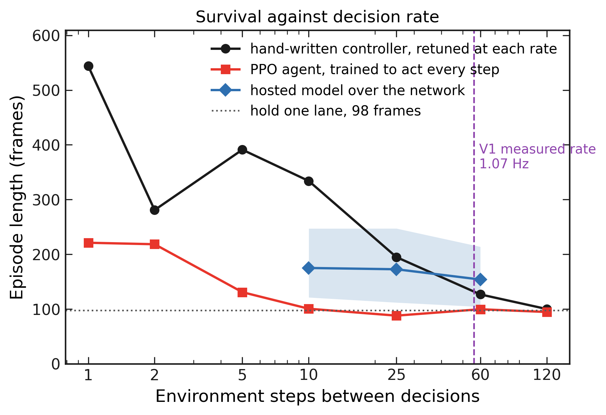

# CrashCourse

PPO obstacle avoidance in a custom Gymnasium environment, built and iterated from scratch.



The agent above is the V5 policy running on the V5 environment at collision tolerance 0.8. It
holds the 3,000 frame cap and makes 243 lane changes across the episode.

---

## What this is

A four-lane obstacle-avoidance environment written from scratch on Gymnasium and Pygame, and a PPO agent trained on it through five iterations. The environment presents forward occupancy across four lanes, and the agent selects a target lane every step. The problem is discrete decision making under a forward-looking observation, with lane position evolving continuously between decisions.

The repository holds the environment, the training and evaluation code, one YAML file per experiment, a test suite, and the figures generated from the training logs.

## Results

The V5 agent evaluated over 100 episodes on the V5 environment:

| Measure | Value |
|---|---|
| Episode length | 3,000 frames on 100 of 100 episodes |
| Episode return | 3,190 |
| Training | 5,242,880 environment transitions |
| Policy network | 3 hidden layers of 1,024 units, 324 input features |
| Wall clock | 39.9 minutes on one RTX 3060 |

Policies compared over the same 100 held-out episode seeds:

| Policy | Episode length (frames) | Reached the cap |
|---|---|---|
| PPO agent | 3,000 | 100% |
| Uniform random action | 87 | 0% |
| Hold the starting lane | 87 | 0% |

The trained agent survives 34 times longer than uniform random action.

The lateral collision test takes a tolerance in car widths, and both settings ship. Every number
here names the one it used.

| tolerance | collision boundary | corridor between adjacent lane centres |
|---|---|---|
| 0.8 | cars overlap by a fifth of a width | 20 px |
| 1.0 | two equal-width cars touch | closed |

The V5 figures above use 0.8. Under 1.0 an alternating two-lane policy reaches 74 frames, a
hand-written safest-lane controller reaches 723, and a fresh PPO run reaches 894 at 400,000
transitions with headroom remaining.

Tolerance 1.0 is the default in `crashcourse/config.py` and `configs/v5_smooth.yaml`.
`configs/ablations/permissive_collision.yaml` holds 0.8 so both reproduce, and `tests/test_env.py`
covers each.

Across one full episode the agent spends 1,010, 1,037, and 942 frames in lanes 0, 1, and 2 respectively, and 11 frames in lane 3. It uses three lanes as working space and treats the fourth as a reserve.

## Figures



**Figure 1.** Episode length across training, from the monitor log of the V5 run. Grey points show each of the 2,669 individual episodes. The red line shows a moving mean over a 100 episode window. The dashed line marks the 3,000 frame episode cap. The x-axis is the cumulative sum of episode lengths, giving 5,215,527 environment transitions.



**Figure 2.** Four views of the same V5 run. (a) Mean episode return with a ±1 standard deviation band over a 100 episode window. (b) Mean episode length against the 3,000 frame cap. (c) Median return with the 25th to 75th percentile band. (d) Percentage of episodes reaching the cap within the rolling window, which climbs to roughly 90% by the end of training. All panels share the x-axis definition given in Figure 1.



**Figure 3.** Distribution of episode length over all 2,669 training episodes. The red dashed line marks the mean and the black dotted line the median. Across the whole run, 45.2% of episodes reached the 3,000 frame cap, a proportion that rises steadily as training progresses.

## Development history

Six iterations, each kept because the reason for moving on shaped what came next.

| Iteration | Approach | Outcome |
|---|---|---|
| V1 | A hosted vision model watching the screen and naming the lane | Measured the control-loop rate that the approach can sustain |
| V2 | First PPO run, 5 feature observation, survival and crash reward only | Reached short episodes and showed the observation needed depth |
| V3 | 81 feature lane occupancy grid, 4 frame stack, 1024×3 network | Published iteration, immediate lane changes |
| V4 | V3 carried forward with revised plotting and evaluation | Fed the figure pipeline used here |
| V5 | Interpolated lane changes, equal car sizes, pixel-overlap collision | 3,000 frames on 100 of 100 episodes |
| V6 | The hosted model rebuilt, and decision rate swept across every controller | 2.04 Hz measured, and a spawn clock identified |

V3 and V5 use identical PPO hyperparameters. The difference between them is the environment mechanics, which makes the pair a single-variable comparison.

### V1: a hosted vision model inside the control loop

The original idea was to let a vision model watch the screen live and drive. V1 streamed the game to `gemini-3.1-flash-live-preview` over the Live API and applied whichever lane the model named. The game advanced at 30 FPS and the connector requested a decision every 0.7 seconds.

The decision interval measured across the logged session averaged 0.94 seconds, with a median of 0.90 and a tail reaching 3.02. That is a decision rate of 1.07 Hz against a loop advancing 30 times per second. In the same session an obstacle crossed the full 360 px height in roughly 3 seconds at the starting speed, giving the model about three decisions per obstacle at best.

A second pass reduced obstacle speed by half and widened the spawn interval, buying one to two seconds per decision. Across the 59 logged decisions the model named lane 2 every time and held that output for the whole session.

The measurement carries the design decision that followed. Closing a loop at this rate calls for a policy that runs inside the loop, and a PPO forward pass on a local GPU returns an action in well under a millisecond. That is where V2 begins, and it is the reason the project moved to reinforcement learning at all.

### V6: revisiting the hosted model

V6 returns to the V1 idea with the same key and model family. Holding one Live
session open for an episode and sending the lane occupancy as text puts the
decision rate at 2.04 Hz over 465 logged decisions, against the 1.07 Hz V1
measured. `crashcourse/gemini_policy.py` holds it.

Any controller can be run at a fixed decision rate, holding one action in
between, which is what a hosted model does inside a real loop. On that axis the
hosted model holds 175, 173, and 154 frames at 10, 25, and 60 steps between
decisions. The hand-written controller reaches 544 frames when it decides every
step, and the comparison is mostly a statement about decision rate.



**Figure 4.** Episode length against environment steps between decisions, on
held-out seeds. The hand-written controller is retuned at every rate. The shaded
band is a bootstrap interval on the hosted mean. The environment renders at 60
frames per second, so 60 steps between decisions is 1 Hz.

Sweeping that axis turned up a property of the environment worth recording. V5
spawns an obstacle every 10 frames exactly, and a controller deciding on a
matching beat samples the world in a fixed phase. `EnvConfig.spawn_jitter`
varies the period, and `configs/v6_decorrelated.yaml` spreads it over 6 to 14
frames with the mean held at 10. Moving to the jittered version, uniform random
action keeps 96% of the result, the hand-written controller keeps 64%, and the
V5 agent keeps 27%. The agent had a periodic schedule available throughout
training. `experiments/spawn_clock.py` reproduces the comparison and
`tests/test_env.py` covers it.

The reward shaping in an early iteration carried a large lane-change penalty. The agent responded by holding one lane and accepting collisions, which is the correct solution to the reward as written. Reducing that penalty to 0.1 restored active dodging. This is the clearest lesson in the project: the agent optimises the reward it is given, so the reward specification carries the intent.

### Learning rate

A controlled comparison at 400,000 transitions on the corrected environment, one seed each:

| Learning rate | 100k | 200k | 300k | 400k |
|---|---|---|---|---|
| 5e-5 | 98 | 136 | 535 | **894** |
| 3e-4, the library default | 120 | 133 | 366 | 384 |

The lower rate reaches more than double the episode length at 400,000 transitions. This result supports keeping 5e-5 as the default in `configs/`. It describes a single seed at one budget.

## Environment

| Property | Value |
|---|---|
| Observation | 4 lanes × 20 forward segments of 50 px, plus normalised lane position, 81 features |
| Action | Discrete(4), the target lane |
| Episode cap | 3,000 frames |
| Obstacles | One spawn every 10 frames in a uniformly chosen lane, descending 10 px per frame |
| Spawn jitter | 0 by default. `configs/v6_decorrelated.yaml` varies the period over 6 to 14 frames |
| Lane transition | Position interpolates toward the target lane at 0.15 per frame |
| Reward | +1.0 survival, +0.1 in a centre lane, −0.1 on a lane change, −100.0 on contact |

Every value is read from a config file. `crashcourse/config.py` holds the defaults and `configs/` holds one YAML per experiment.

### Scope of the reported numbers

Every evaluation names the collision tolerance used, and the two settings are tabulated under
[Results](#results). At 0.8 the 20 px corridor between adjacent lane centres is wide enough for a
policy alternating between two lanes to settle inside it, so a V5 number describes the environment
alongside the agent. At 1.0 that corridor closes.

Episode seeding runs through `self.np_random`, so `reset(seed=k)` reproduces an episode exactly. The test suite asserts this.

## Reproducing

```bash
pip install -r requirements.txt

# watch the archived V5 agent
python watch.py --config configs/ablations/permissive_collision.yaml \
                --model models/ppo_drive_final.zip --episodes 3

# train on the current default configuration
python train.py --config configs/v5_smooth.yaml --seed 0

# compare every policy over 200 held-out episode seeds
python evaluate.py --config configs/v5_smooth.yaml --episodes 200

# reproduce the original heavy V5 run
python train.py --config configs/v5_full.yaml --seed 0

# regenerate the figures
python create_graphs.py --monitor logs/monitor.csv

# drive with the hosted model, needs GEMINI_API_KEY
python evaluate.py --config configs/v6_decorrelated.yaml --gemini --episodes 16

# measure reliance on the periodic spawn clock
python experiments/spawn_clock.py

# figures for decision rate, latency, and the spawn clock
python experiments/cadence_figure.py

# run the study across every configuration
python experiments/run_ablation.py --seeds 3
```

Tests:

```bash
pytest tests/ -q
```

## Repository layout

```
crashcourse/        environment, config, policies, evaluation, figure style
                    and gemini_policy.py, the hosted model as a Policy
configs/            one YAML per experiment, ablations in configs/ablations/
train.py            train one configuration with one seed
evaluate.py         compare policies over shared held-out seeds
watch.py            render a policy, or record it to a GIF
create_graphs.py    figures from a training monitor log
experiments/        the study, the spawn-clock run, the cadence figures,
                    and the archive recording script
tests/              environment contract and regression tests
models/             the archived V5 policy
logs/               the V5 training monitor and evaluation logs
```

The four earlier iterations stay on local disk. Two of them carry embedded git
repositories and four model archives totalling 440 MB, and the development
history above records what each one did.

## Evaluation protocol

Every policy runs on the same list of held-out episode seeds, starting at 10,000, which keeps comparisons paired. Three quantities stay separate throughout:

- **Episode length**, frames survived, capped at 3,000
- **Return**, the cumulative PPO reward, which depends on the reward configuration in use
- **Success rate**, the proportion of episodes reaching the cap

Return values are comparable within one reward configuration. Episode length is comparable across all of them, which makes it the primary measure.

Confidence intervals come from a bootstrap over episodes, at 10,000 resamples.

---

Built with Claude and Gemini as collaborators.
